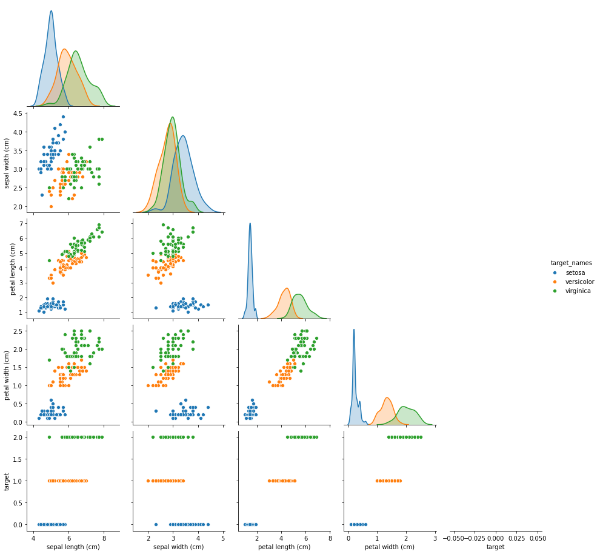
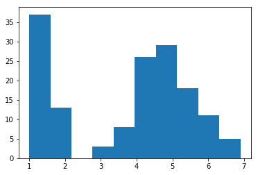

# Frequentist vs Bayesian
Frequentist
* Hypothesis Tests
* A/B Testing
* Experimental Testing

Bayesian
* Machine Learning
* Deep Learning
* Unsupervised Learning
* Supervised Learning

# Objectives
* Calculate Bayesian Priors for the Iris Dataset
* Calculate Conditional Probabilities on the Iris Dataset

# Scenario
You've been given the iris dataset to build a model on...but first you want to do some EDA and Statistical Exploration. 

Our goal today is just to calculate some conditional probabilities so we can answer the question:
* if given a feature = X from a random iris flower what is the probability that the random iris flower is a setosa, virginica, versicolor? 


```python
import pandas as pd
import numpy as np
import scipy.stats as scs

from sklearn.datasets import load_iris

import matplotlib.pyplot as plt
import seaborn as sns
```


```python
iris = load_iris()
data = iris.data
target = iris.target
target_names = iris.target_names
columns = iris.feature_names
```


```python
df = pd.DataFrame(data, columns=columns)
df['target'] = target
df['target_names'] = df['target'].apply(lambda x: target_names[x])
df.head()
```


<div>
<style scoped>
    .dataframe tbody tr th:only-of-type {
        vertical-align: middle;
    }

    .dataframe tbody tr th {
        vertical-align: top;
    }

    .dataframe thead th {
        text-align: right;
    }
</style>
<table border="1" class="dataframe">
  <thead>
    <tr style="text-align: right;">
      <th></th>
      <th>sepal length (cm)</th>
      <th>sepal width (cm)</th>
      <th>petal length (cm)</th>
      <th>petal width (cm)</th>
      <th>target</th>
      <th>target_names</th>
    </tr>
  </thead>
  <tbody>
    <tr>
      <td>0</td>
      <td>5.1</td>
      <td>3.5</td>
      <td>1.4</td>
      <td>0.2</td>
      <td>0</td>
      <td>setosa</td>
    </tr>
    <tr>
      <td>1</td>
      <td>4.9</td>
      <td>3.0</td>
      <td>1.4</td>
      <td>0.2</td>
      <td>0</td>
      <td>setosa</td>
    </tr>
    <tr>
      <td>2</td>
      <td>4.7</td>
      <td>3.2</td>
      <td>1.3</td>
      <td>0.2</td>
      <td>0</td>
      <td>setosa</td>
    </tr>
    <tr>
      <td>3</td>
      <td>4.6</td>
      <td>3.1</td>
      <td>1.5</td>
      <td>0.2</td>
      <td>0</td>
      <td>setosa</td>
    </tr>
    <tr>
      <td>4</td>
      <td>5.0</td>
      <td>3.6</td>
      <td>1.4</td>
      <td>0.2</td>
      <td>0</td>
      <td>setosa</td>
    </tr>
  </tbody>
</table>
</div>


# Calculate the Conditional Probability for 
* given a flower has a petal length of X
* what is the probability it is a setosa, versicolor and iris? 


Problems
1. P(Setosa|PL=X)
2. P(Virginica|PL=X)
3. P(Versicolor|PL=X)


```python
sns.pairplot(data=df, hue='target_names', corner=True)
plt.show()
```

    /Users/rafael/anaconda3/envs/flatiron-env/lib/python3.6/site-packages/seaborn/distributions.py:288: UserWarning: Data must have variance to compute a kernel density estimate.
      warnings.warn(msg, UserWarning)





```python
plt.hist(df['petal length (cm)'])
```


    (array([37., 13.,  0.,  3.,  8., 26., 29., 18., 11.,  5.]),
     array([1.  , 1.59, 2.18, 2.77, 3.36, 3.95, 4.54, 5.13, 5.72, 6.31, 6.9 ]),
     <a list of 10 Patch objects>)





# Step 0 - get the data
* pl for each flower type
* pl for all the flowers together


```python
pl_d = {} # {setosa: petal length of all setosas, versicolor: pl of versicolors, etc, all: pl for all}
for target_name in target_names:
    key = target_name
    value = df.loc[df['target_names']==target_name, 'petal length (cm)']
    pl_d[key] = value
```


```python
pl_d['all'] = df['petal length (cm)']
```


```python
pl_d.keys()
```


    dict_keys(['setosa', 'versicolor', 'virginica', 'all'])


# setting up a bayesian problem
# question a
P(Setosa|3.9<=pl<=4.1) = 

* `numerator -> P(Setosa)* P(3.9<=pl<=4.1|Setosa)`
* `denominator -> P(3.9<=pl<=4.1)`
* CDF(4.1) - CDF(3.9)
* fit a distribution on our dataset


```python
def cdf_arr(arr, p):
    return scs.norm(arr.mean(), arr.std()).cdf(p)

def cdf_bw_arr(arr, x1, x2):
    """
    x1 < x2
    """
    return cdf_arr(arr, x2) - cdf_arr(arr, x1)
```

# Final Step Calculate each part of Bayesian Formula


```python
# P(Setosa)
p_setosa = 1/3
p_pl_g_setosa = cdf_bw_arr(pl_d['setosa'], 3.9, 4.1)
print(p_pl_g_setosa)
p_pl = cdf_bw_arr(pl_d['all'], 3.9, 4.1)

(p_setosa*p_pl_g_setosa)/p_pl
```

    0.0


    0.0


```python
# P(Versicolor)
p_versicolor = 1/3
p_pl_g_versicolor = cdf_bw_arr(pl_d['versicolor'], 3.9, 4.1)
p_pl = cdf_bw_arr(pl_d['all'], 3.9, 4.1)

(p_versicolor*p_pl_g_versicolor)/p_pl
```


    1.0795483801959758


```python
# P(Virginica)
p_virginica = 1/3
p_pl_g_virginica = cdf_bw_arr(pl_d['virginica'], 3.9, 4.1)
print(p_pl_g_virginica)
p_pl = cdf_bw_arr(pl_d['all'], 3.9, 4.1)

(p_virginica*p_pl_g_virginica)/p_pl
```

    0.0028777147830150547


    0.02143449277196596


```python
def calculate_prob(label, x1, x2):
    p_label= 1/3
    p_pl_g_label = cdf_bw_arr(pl_d[label], x1, x2)
    p_pl = cdf_bw_arr(pl_d['all'], x1, x2)
    return (p_label*p_pl_g_label)/p_pl
```


```python
calculate_prob('virginica', 3.9, 4.1)
```


    0.02143449277196596


```python
def label_flower_pl(x1, x2):
    probabilities = {"setosa": 0.0, "virginica": 0.0, "versicolor": 0.0}
    for key in probabilities:
        prob = calculate_prob(key, x1, x2)
        probabilities[key] = prob 
    print(probabilities)
    max_prob = max(probabilities.values())
    for k, v in probabilities.items():
        if v == max_prob:
            return k
```


```python
label_flower_pl(3.9, 4.1)
```

    {'setosa': 0.0, 'virginica': 0.02143449277196596, 'versicolor': 1.0795483801959758}


    'versicolor'


```python
label_flower_pl(4.95, 5.1)
```

    {'setosa': 0.0, 'virginica': 0.8742670717831239, 'versicolor': 0.4336320523109145}


    'virginica'


```python
label_flower_pl(4.95, 5.0)
```

    {'setosa': 0.0, 'virginica': 0.7829145056208665, 'versicolor': 0.49938124770782055}


    'virginica'


```python
label_flower_pl(1.0, 1.5)
```

    {'setosa': 4.699957965905978, 'virginica': 8.481041407263922e-13, 'versicolor': 1.7196829293374097e-08}


    'setosa'


# What we learned
* learned the difference between frequentist and bayesian
* learned how to populate a dictionary
* CDF is always less than
* assuming normality pros and cons
* how bayesian fits into what we're doing


```python

```
